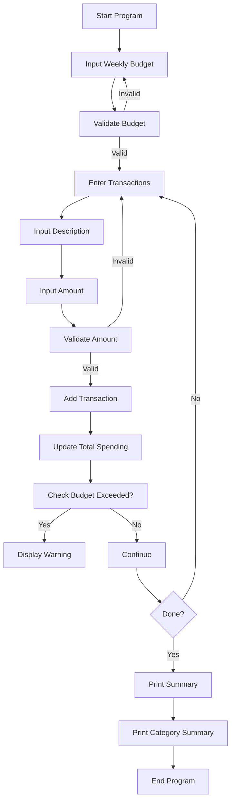

## Flowchart

Markdown
## Pseudocode
START
Create CategoryBudgetTracker object
INPUT weekly budget
WHILE budget is negative 
      Display error
      INPUT budget again
END WHILE

REPEAT
INPUT transaction description
IF description = "done" AND transactions < 5 
    Display message : minimum 5 transactions 
required 
    CONTINUE 
END IF
IF description = "done"
   BRAEK
END IF 
INPUT transaction amount
IF amount is negative 
   Display error 
   CONTINUE
END IF
Add transaction
Update total spending 
Check if budget exceeded
UNTIL user finishes 

Print final summary 
Print category summary

END
